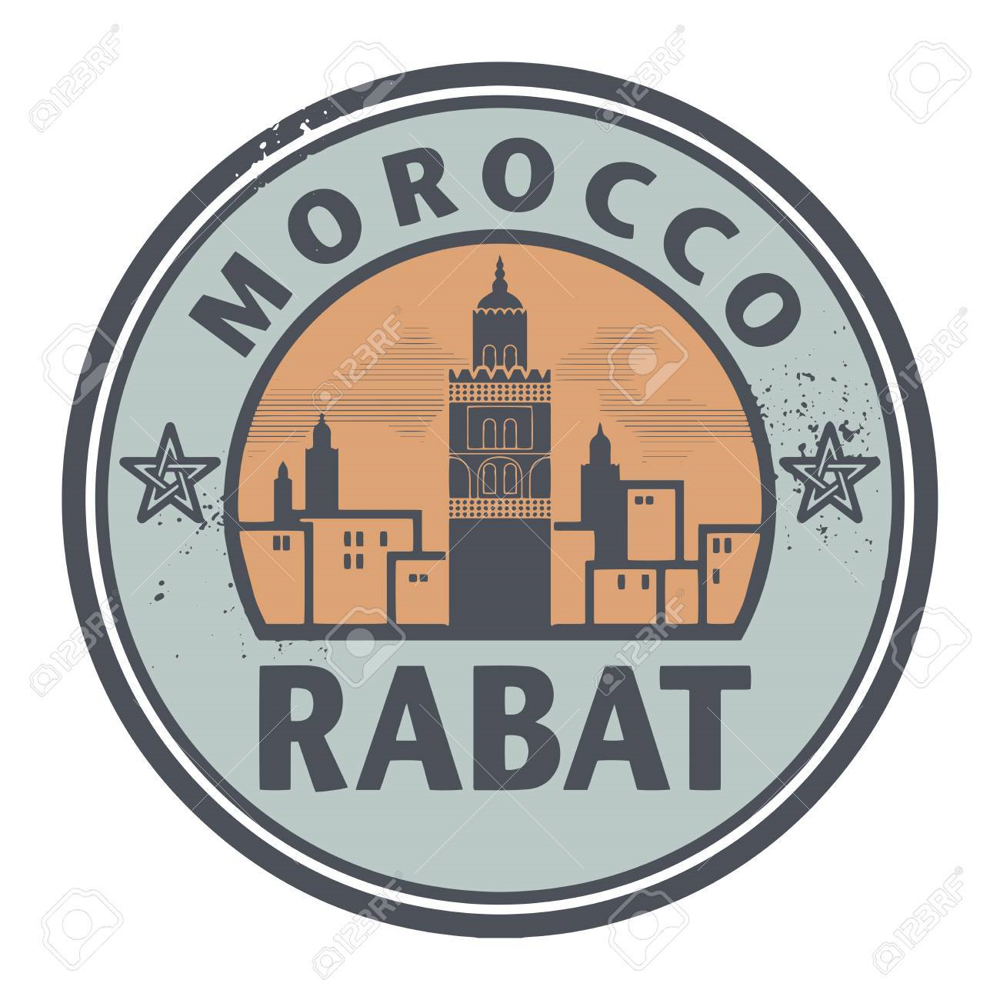

# Introduction

{:width="300px" }*Figure 1: Rabat*

<!-- note -->

Rabat, la capitale du Maroc, est bâtie sur les rives du fleuve Bouregreg et de l'océan Atlantique. Elle est connue pour ses sites d'intérêt, qui illustrent tant le patrimoine islamique que colonial français, notamment la kasbah des Oudayas. Ce fort royal de l'époque berbère est entouré par des jardins formels de style français et surplombe l'océan. L'emblématique tour Hassan de la ville, un minaret du XIIe siècle, domine les vestiges d'une mosquée.
<!-- new slide -->