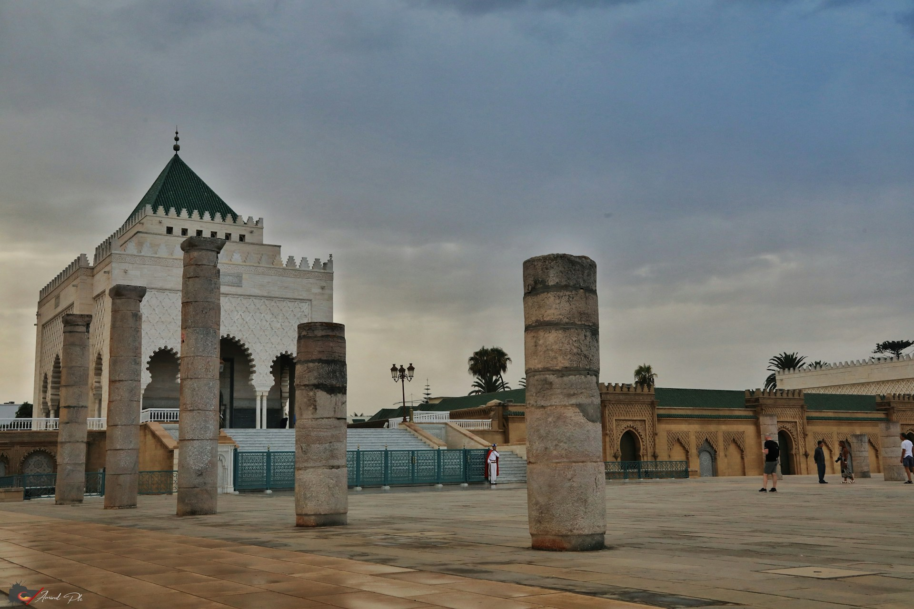

# Histoire
{:width="500px" }*Figure 2: Histoire de Rabat*

<!-- note -->

La ville a été fondée au 12em siècle par les Almohades12, qui y édifièrent une citadelle (devenue la kasbah des Oudayas), une mosquée et une résidence. C’était alors ce qu'on appelle un ribat (« forteresse »13). Le nom actuel vient de Ribat Al Fath, « le Camp de la Victoire ». Plus tard, le petit-fils de Abd Al-Mūmin — Ya'qub al-Mansūr — agrandit et compléta la ville, l'entourant notamment de murailles. Par la suite, elle servit de base aux expéditions almohades en Andalousie.

Après 1269, quand les Mérinides choisirent Fès comme capitale, Rabat entra dans une période de déclin. Ainsi, l'explorateur morisque Hassan al-Wazzan a rapporté qu'il n'y subsistait que 100 maisons habitées en 1515. En 1609, à la suite du décret d’expulsion de Philippe III, 13 000 Morisques y trouvèrent refuge, revitalisant ainsi la ville14. Jusqu'au xixe siècle, Rabat est connue sous le nom de Salé-le-Neuf.

En 1912, Lyautey fit de Rabat le siège du résident général et la capitale du protectorat français au Maroc15. En 1956, à l’indépendance du Maroc, la ville resta la capitale du pays16.
<!-- new slide -->